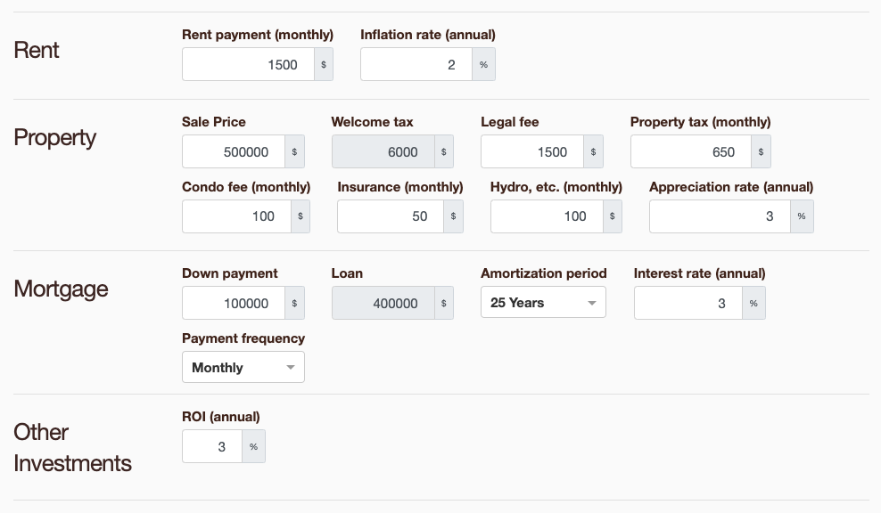
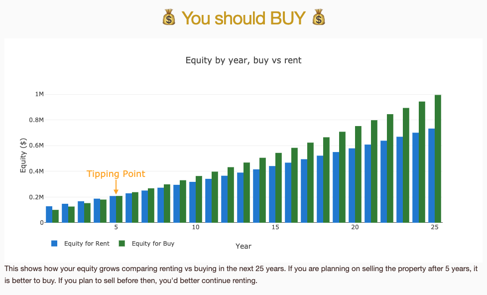
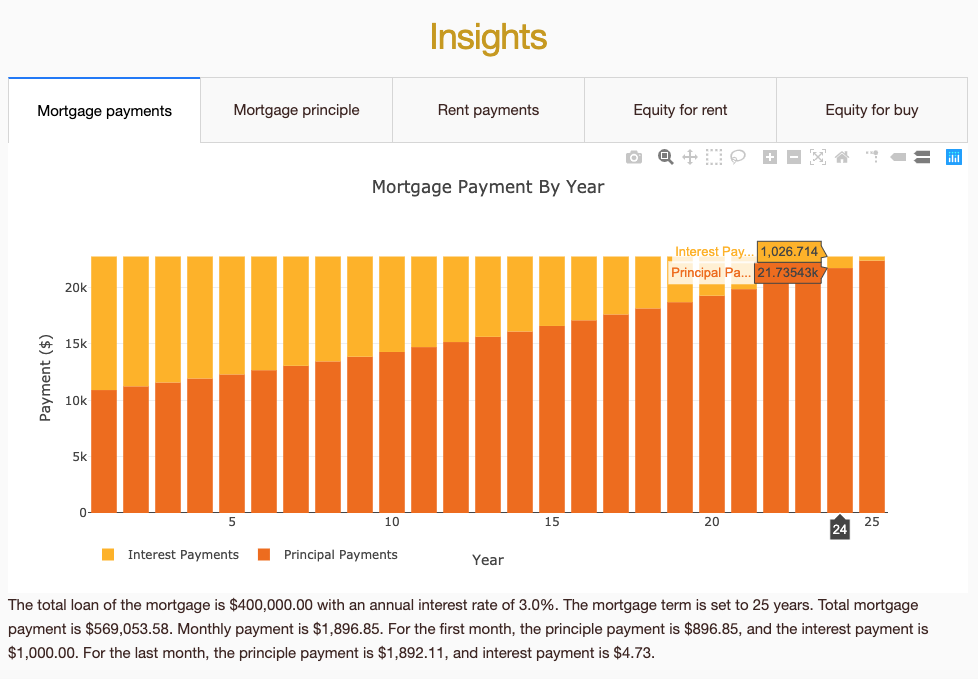

# Vancouver

> Most overpriced real estate market in Canada.

A simple tool for calculating mortgage, property tax, rent, etc., which can be useful for making a decision about whether to buy or rent.





## Conda Environment

We use conda for managing environments. Check these for detail: 

* <https://conda.io/docs/user-guide/tasks/manage-environments.html>
* <https://conda.io/en/master/miniconda.html>

Apart from that, this is required for conda to install packages like `dash`:

```bash
conda config --append channels conda-forge
```

Here are a few useful commands.

Create, update, delete environment:

```bash
conda env create -f environment.yml -nanme vancouver 
conda env update -f environment.yml -nanme vancouver
conda env remove --name vancouver
```

Activate environment:

```bash
source activate vancouver
```
    
Export environment:

```bash
conda env export --no-build | grep -v "^prefix: " > environment-freeze-mac.yml
```

## Deploy

```
sudo systemctl stop vancouver

sudo cp vancouver.service /etc/systemd/system/vancouver.service
sudo systemctl start vancouver
```
